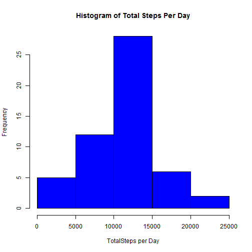
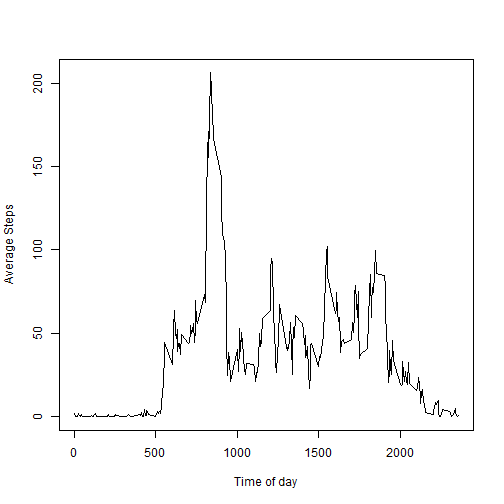
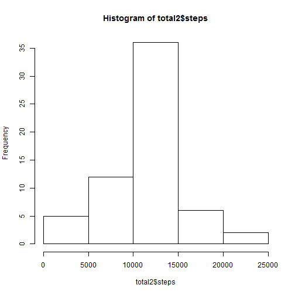
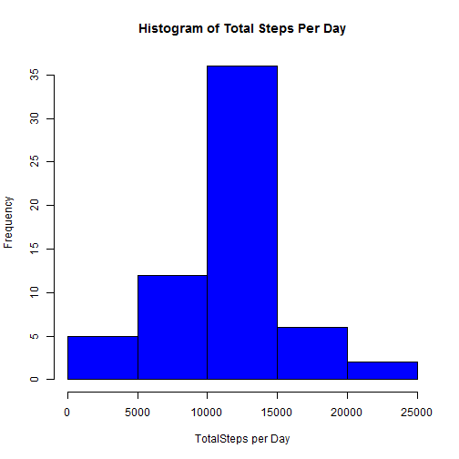

The objective of this project was to analyze data from a personal activity monitoring device. The device collects data at 5 minute intervals through out the day. The data consists of a full 2 months of data fom October to November 2012 with the number of steps collected in 5 minute intervals through out each day.

## Loading and preprocessing the data

Original data can be obtained from the following url 
https://d396qusza40orc.cloudfront.net/repdata%2Fdata%2Factivity.zip

The data used in the following analysis was in the RepData_PeerAssessment for on GitHub on 2015-07-17.

The github directory was cloned to a Github subdirectory of my home directory and the data loaded and accessed from there.  The data contains a header for the first row and dates in the second column.  The data was loaded with stringsAsFactors=FALSE to keep the dates as character types.

```r
setwd("~/GitHub/RepData_PeerAssessment1")
activity <- read.csv("activity/activity.csv", header=TRUE, stringsAsFactors=FALSE)
```


## What is mean total number of steps taken per day?

To answer this question, the data was grouped by date using dplyr functions and the total number of steps for each day was calculated.  A histrogram was created and mean and median values calculated using default breaks.

```r
library(dplyr)
total <- activity %>%
 group_by(date) %>%
 summarize(steps = sum(steps))
hist(total$steps, xlab='TotalSteps per Day', 
     main='Histogram of Total Steps Per Day')
```

 

```r
mean(total$steps, na.rm=TRUE)
```

```
## [1] 10766.19
```
The median was calculated as:
'''{r}
median(total$steps, na.rm=TRUE)
```
The mean was calculated as:

```r
max(total$steps, na.rm=TRUE)
```

```
## [1] 21194
```


## What is the average daily activity pattern?

To answer this question, the steps the mean was calculated for each 5 minute interval. NA's were removed from the calculation. 


```r
daily.activity <- tapply(activity$steps, activity$interval, mean, na.rm=TRUE)
plot(names(daily.activity), daily.activity, type='l', xlab='Time of day', ylab='Average Steps')
```

 

To determine the 5-minute interval that contains the maximum number of steps on average.  The activity result was sorted descending and the maximum interval found.

```r
top.value <- head(sort(daily.activity, decreasing=TRUE), n=1)
top.value
```

```
##      835 
## 206.1698
```
The maximum interval corresponded to 8:35AM in the morning. 

## Imputing missing values

The original dataset contained missing values (NA's).

```r
total.na = sum(is.na(activity$steps))
```
The total NA's were 2304. 

A strategy to for filling in the missing values could be to use the mean for the 5 minute interval calculated above.
This was implemented by copying the daily.activity means calculated above to a copy of the original activity dataset. All NAs were then replaced with the corresponding mean values.


```r
activity2 <- activity
activity2$intmeans <- rep(daily.activity, 61)
activity2[is.na(activity2$steps),"steps"] <- activity2[is.na(activity2$steps), "intmeans"]
```
The histogram, mean and median values were recomputed with the new dataset.

```r
total2 <- activity2 %>%
 group_by(date) %>%
 summarize(steps = sum(steps))
hist(total2$steps)
```

 

```r
mean(total2$steps, na.rm=TRUE)
```

```
## [1] 10766.19
```

```r
median(total2$steps, na.rm=TRUE)
```

```
## [1] 10766.19
```
The differences were very little.

## Are there differences in activity patterns between weekdays and weekends?

```r
library(lattice)
activity2$daytype <- as.factor(ifelse(grepl('^S', weekdays(as.Date(activity2$date))), "weekend", "weekday"))
daily.activity2 <- activity2 %>%
 group_by(interval, daytype) %>%
 summarize(steps = mean(steps))
xyplot(steps ~ interval | daytype, data = daily.activity2,
type = "l", lty = 1, strip.left = TRUE, strip = FALSE, layout=c(1,2))
```

 
